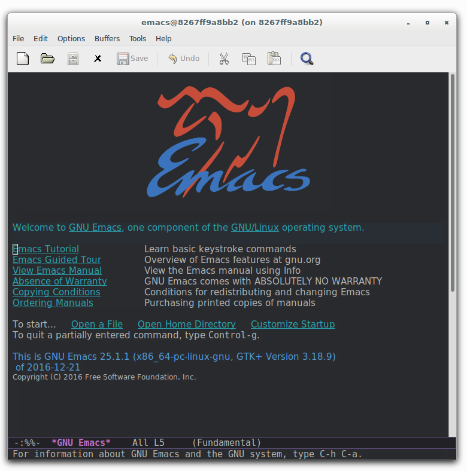

### Example of build from jare/emacs Docker image



#### It adds:
 - firefox
 - [spacemacs-theme](https://github.com/nashamri/spacemacs-theme) (downloaded and installed with Dockerfile)
 - user

#### How to run:
```
docker run -ti --name emacs -v /tmp/.X11-unix:/tmp/.X11-unix:ro\
 -e DISPLAY="unix$DISPLAY"\
 -v <path_to_your_workspace>:/mnt/workspace\
 jare/docker-emacs-example emacs (or firefox)
```

*See https://github.com/JAremko/docker-emacs for more details*
